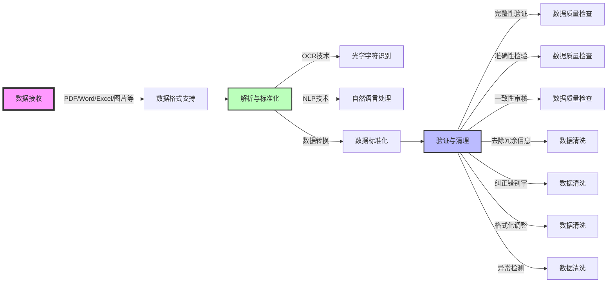

```mermaid
graph LR
    A[数据接收] -->|PDF/Word/Excel/图片等| B[数据格式支持]
    B --> C[解析与标准化]
    C -->|OCR技术| D[光学字符识别]
    C -->|NLP技术| E[自然语言处理]
    C -->|数据转换| F[数据标准化]
    F --> G[验证与清理]
    G -->|完整性验证| H[数据质量检查]
    G -->|准确性检验| I[数据质量检查]
    G -->|一致性审核| J[数据质量检查]
    G -->|去除冗余信息| K[数据清洗]
    G -->|纠正错别字| L[数据清洗]
    G -->|格式化调整| M[数据清洗]
    G -->|异常检测| N[数据清洗]

    style A fill:#f9f,stroke:#333,stroke-width:4px
    style G fill:#bbf,stroke:#333,stroke-width:2px
    style C fill:#bfb,stroke:#333,stroke-width:2px
```